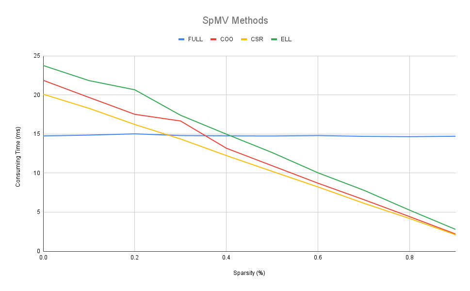

# SpMV
##Sparse Matrix &amp; Vector Multiplication

## How to run

`g++ -std=c++11 -mavx ./main.cpp`

SpMV method: choose one of `FULL`, `COO`, `CSR`, `ELL`, or `DIA` options.

Using Vector Sparsity: if you want to be used choose `y`, otherwise `n`.

Using SIMD: if you want to be used choose `y`, otherwise `n`. (note: it is implemented for `COO`, `CSR`, and `ELL` methods.)

Parallelism: if you want to run parallel choose `y`, otherwise `n`. (note: it is implemented for `CSR` and `ELL` methods.)
